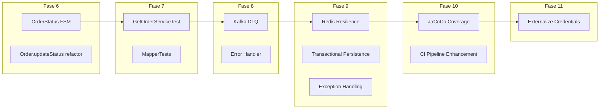

# Plan de Mejores Prácticas y Calidad — OMS v2

## Diagnóstico del Estado Actual

Tras un análisis exhaustivo del repositorio, estos son los hallazgos organizados por categoría:

### ✅ Lo que ya está bien hecho
- Arquitectura Hexagonal bien implementada (Domain → Application → Infrastructure)
- Separación de Puertos de Entrada/Salida correcta
- Servicios de Aplicación puros (sin `@Service` de Spring)
- MapStruct para mapeo entre capas (REST ↔ Domain ↔ JPA)
- Flyway para migraciones de base de datos
- Docker Compose con healthchecks
- Swagger/OpenAPI con anotaciones en controladores
- Distributed Tracing con Micrometer + Zipkin
- Spring Security con Basic Auth
- Testcontainers para tests de integración (PostgreSQL)
- CI básico con GitHub Actions (`mvn clean verify`)

### ⚠️ Brechas Identificadas

| # | Categoría | Brecha | Impacto |
|---|-----------|--------|---------|
| 1 | **Testing** | No existen tests unitarios para `GetOrderService` ni para `Order.updateStatus()` | Cobertura baja del core de negocio |
| 2 | **Testing** | No hay tests para los mappers (REST y Persistence) | Regresiones silenciosas en mapeo de datos |
| 3 | **Kafka** | Sin `ErrorHandler` ni Dead Letter Queue (DLQ) | Mensajes fallidos se pierden silenciosamente |
| 4 | **Kafka** | El Consumer reconstruye un `Order` parcial (sin items) | Datos inconsistentes en Redis cache |
| 5 | **Domain** | `OrderStatus` no valida transiciones (PENDING→SHIPPED es posible) | Violación de reglas de negocio |
| 6 | **Domain** | `Order` usa Lombok `@NoArgsConstructor` + `@AllArgsConstructor` — rompe encapsulamiento | Facilita construcción de estados inválidos |
| 7 | **Resiliencia** | `PostgresOrderAdapter.save()` no usa `@Transactional` | Posibles escrituras parciales en BD |
| 8 | **Resiliencia** | `RedisOrderAdapter` no maneja excepciones de conexión | Un Redis caído tumba toda la aplicación |
| 9 | **CI/CD** | GitHub Actions solo compila, no ejecuta tests de integración (no hay Docker) | Falsa confianza en el pipeline |
| 10 | **Calidad** | No hay reporte de cobertura (JaCoCo) | Imposible medir la deuda técnica |
| 11 | **API** | `updateStatus` en controller parsea el enum con `valueOf()` sin try-catch | `IllegalArgumentException` sin manejar explícitamente|
| 12 | **Config** | Credenciales hardcodeadas (`admin`/`admin123`) sin externalización | Riesgo de seguridad |

---

## Propuesta de Ejecución por Fases

> [!IMPORTANT]
> Cada fase se implementará en su propia rama (`feat/xxx`) y se subirá mediante **Pull Request** siguiendo la política establecida.

---

### Fase 6 — Fortalecimiento del Dominio
> **Objetivo:** Hacer que el modelo de dominio sea verdaderamente robusto e imposible de usar incorrectamente.

#### [MODIFY] OrderStatus.java
- Implementar una **máquina de estados formal**: cada valor del enum declarará sus transiciones válidas.
- Método `canTransitionTo(OrderStatus target)` que valida si la transición es legal.
- Ejemplo: `PENDING` solo puede ir a `CONFIRMED` o `CANCELLED`, nunca directo a `SHIPPED`.

#### [MODIFY] Order.java
- Refactorizar `updateStatus()` para delegar validación al enum: `this.status.canTransitionTo(newStatus)`.
- Añadir `updatedAt` (LocalDateTime) para auditoría de mutaciones.

#### [NEW] `OrderStatusTest.java`
- Tests para cada transición válida e inválida de la máquina de estados.

#### [MODIFY] OrderTest.java
- Añadir tests para `updateStatus()` incluyendo transiciones inválidas (ej. `PENDING → SHIPPED`).

---

### Fase 7 — Cobertura de Tests Unitarios
> **Objetivo:** Cerrar las brechas de cobertura en Application y Domain layers.

#### [NEW] `GetOrderServiceTest.java`
- Test `getOrderById` con cache hit (retorna desde Redis mock).
- Test `getOrderById` con cache miss + DB hit (retorna desde repo mock, guarda en cache mock).
- Test `getOrderById` con cache miss + DB miss → lanza `OrderNotFoundException`.
- Test `updateStatus` → verifica que invoca `order.updateStatus()`, persiste y evicta cache.
- Test `getAllOrders` → delega a repositorio.

#### [NEW] `OrderRestMapperTest.java`
- Verificar que `toDomainCommand()` ignora campos calculados (`id`, `status`, `totalAmount`).
- Verificar que `toResponseDto()` mapea correctamente todos los campos incluyendo items.

#### [NEW] `OrderPersistenceMapperTest.java`
- Verificar mapeo bidireccional `Domain ↔ JPA Entity`, incluyendo relación parent-child de items.

---

### Fase 8 — Resiliencia de Kafka (DLQ y Error Handling)
> **Objetivo:** Garantizar que los mensajes fallidos no se pierdan y el consumidor sea resiliente.

#### [MODIFY] KafkaConfig.java
- Configurar `DefaultErrorHandler` con `FixedBackOff` (3 reintentos, 1s entre cada uno).
- Configurar `DeadLetterPublishingRecoverer` para enviar mensajes fallidos al topic `order-events.DLT`.
- Crear bean `NewTopic` para el Dead Letter Topic.

#### [MODIFY] OrderEventConsumer.java
- Añadir `try-catch` interno con logging estructurado para errores de deserialización o procesamiento.
- Mejorar la reconstrucción del `Order` para que sea más robusta (validación de nulls en el evento).

---

### Fase 9 — Resiliencia de Infraestructura
> **Objetivo:** Que un fallo en Redis o Kafka no tumbe el sistema entero.

- [x] **9.1** **Modify `RedisOrderAdapter.java`**: Envolver todas las operaciones de Redis en `try-catch(RedisConnectionFailureException)`.
- [x] **9.2** **Modify `PostgresOrderAdapter.java`**: Añadir `@Transactional` al método `save()` para garantizar atomicidad.
- [x] **9.3** **Modify `GlobalExceptionHandler.java`**: Añadir handlers para `IllegalArgumentException` y un generic `Exception.class`.

---

### Fase 10 — Pipeline CI/CD Robusto + Cobertura
> **Objetivo:** Un pipeline que realmente garantice calidad en cada PR.

- [x] **10.1** **Modify `pom.xml`**: Añadir plugin **JaCoCo** para generar reportes de cobertura de código.
- [x] **10.2** **Modify `pom.xml`**: Configurar regla de cobertura mínima: **70%** en las capas `domain` y `application`.
- [x] **10.3** **Modify `ci.yml`**: Activar Docker en el runner (por defecto en ubuntu-latest) y añadir step para publicar el reporte de JaCoCo como artefacto.
- [x] **10.4** **Modify `ci.yml`**: Añadir step de cache de Maven para acelerar builds (ya estaba implementado en setup-java@v4).

---

### Fase 11 — Externalización de Credenciales
> **Objetivo:** Eliminar credenciales hardcodeadas del código fuente.

- [x] **11.1** **Modify `SecurityConfig.java`**: Externalizar `username` y `password` a `application.yml` usando `@Value`.
- [x] **11.2** **Modify `application.yml`**: Añadir sección `oms.security.username` / `oms.security.password` con valores por defecto.

---

## Resumen Visual del Plan

---

## Plan de Verificación

| Fase | Verificación | Comando |
|------|-------------|---------|
| 6 | Tests unitarios de estado pasan | `mvn test -Dtest="OrderStatusTest,OrderTest"` |
| 7 | Todos los unit tests pasan | `mvn test` |
| 8 | Kafka consumer maneja errores sin crash | `mvn test` + verificación manual con mensajes malformados |
| 9 | App funciona con Redis apagado | Apagar Redis en Docker y verificar que GET funciona desde DB |
| 10 | Pipeline CI pasa + reporte de cobertura generado | Push a rama → ver GitHub Actions |
| 11 | App arranca con env vars personalizadas | `OMS_SECURITY_USER=x OMS_SECURITY_PASS=y mvn spring-boot:run` |
